# 📊 Diagramas do Projeto - Discord SDK Test

Este documento contém todos os diagramas avançados do sistema, incluindo arquitetura, classes, sequência, componentes, fluxo de dados, estados e threads.

---

## 🏗️ 1. Diagrama de Arquitetura do Sistema

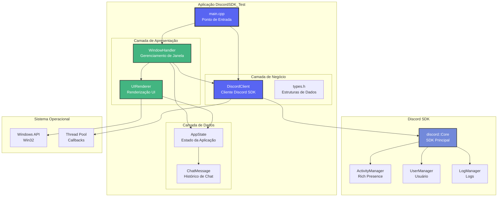

---

## 📐 2. Diagrama de Classes UML

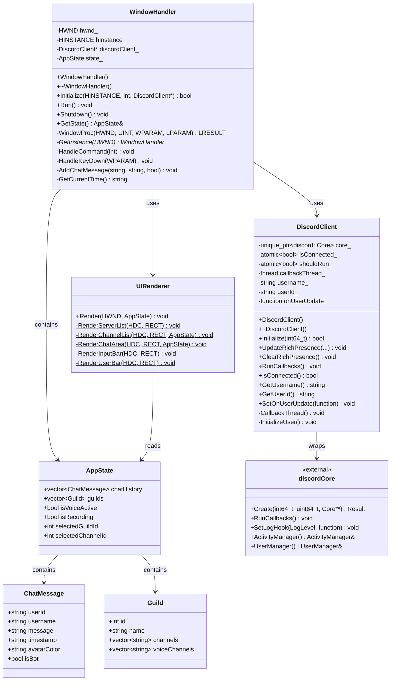

---

## 🔄 3. Diagrama de Sequência - Inicialização

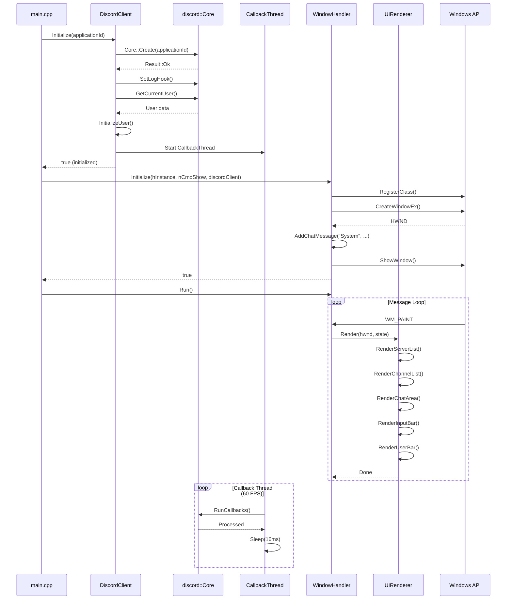

---

## 🔄 4. Diagrama de Sequência - Atualização de Rich Presence

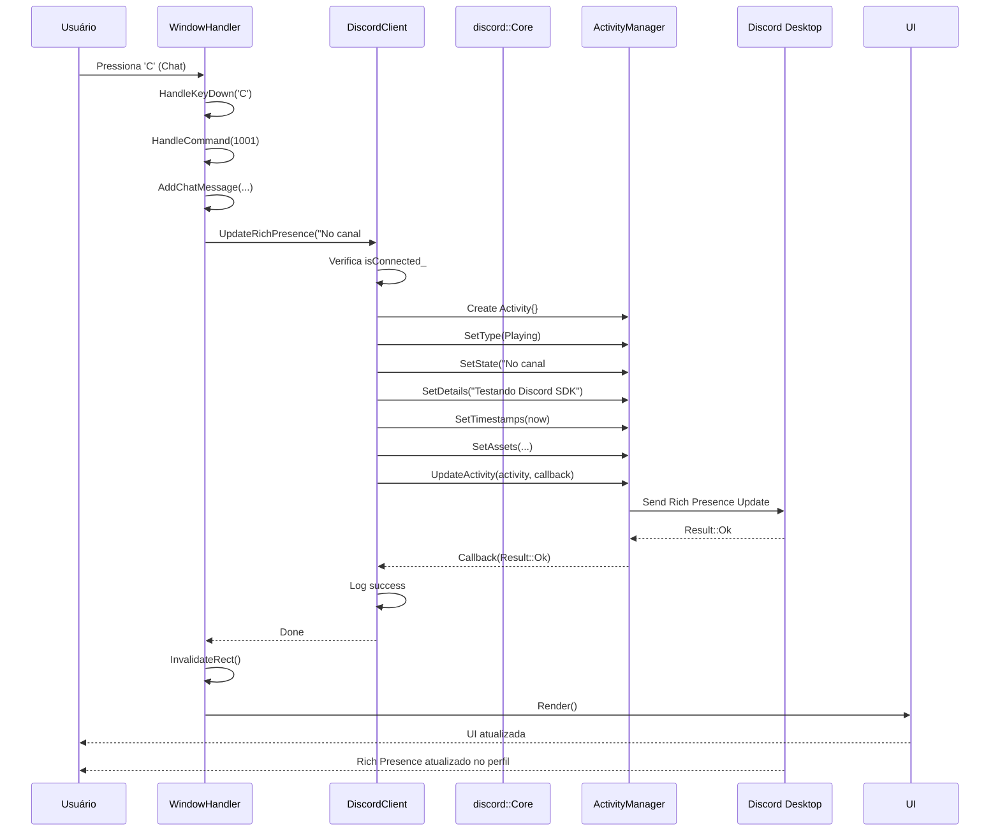

---

## 🧩 5. Diagrama de Componentes

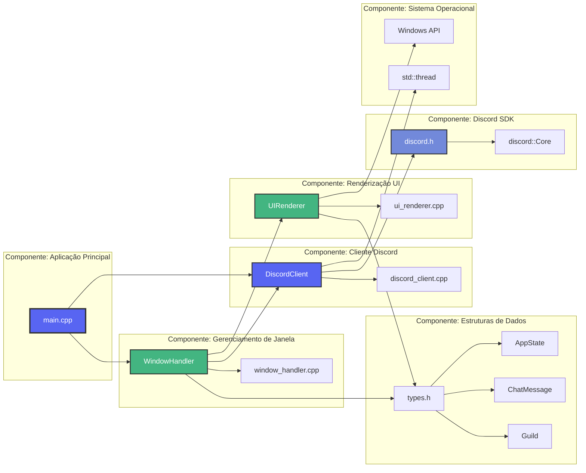

---

## 🌊 6. Diagrama de Fluxo de Dados

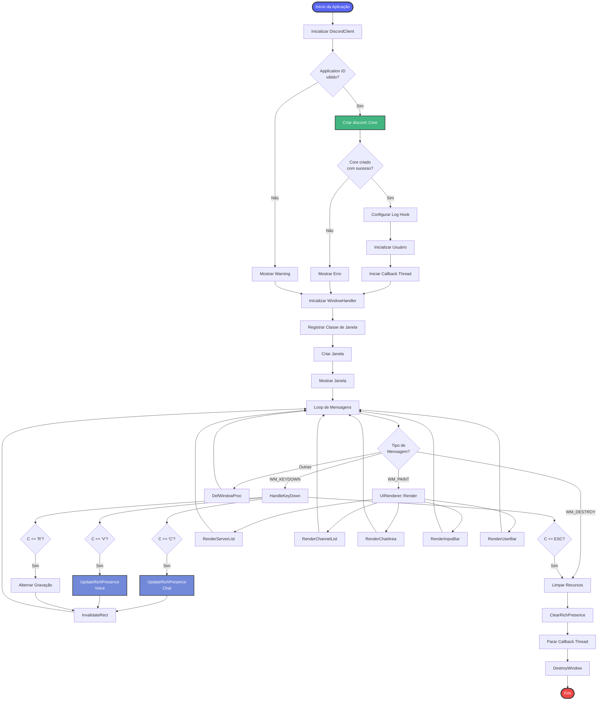

---

## 🔄 7. Diagrama de Estados

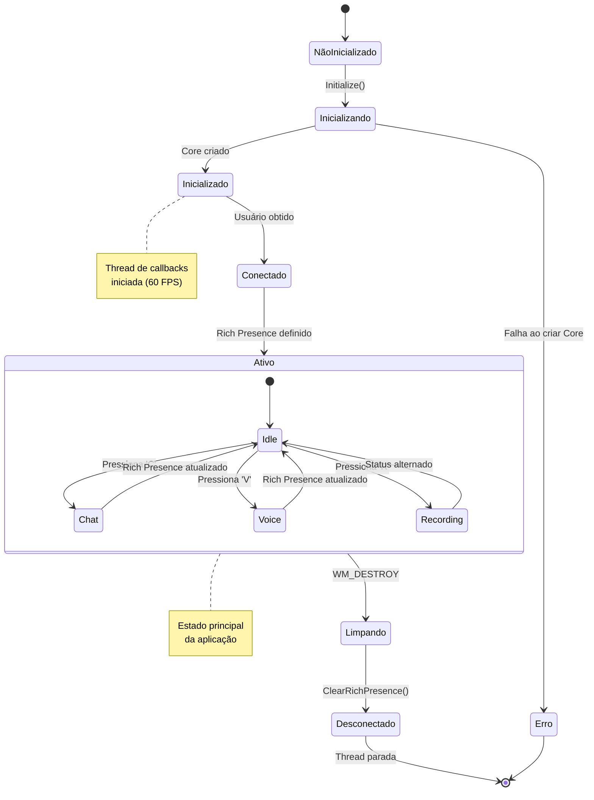

---

## 🧵 8. Diagrama de Threads e Concorrência

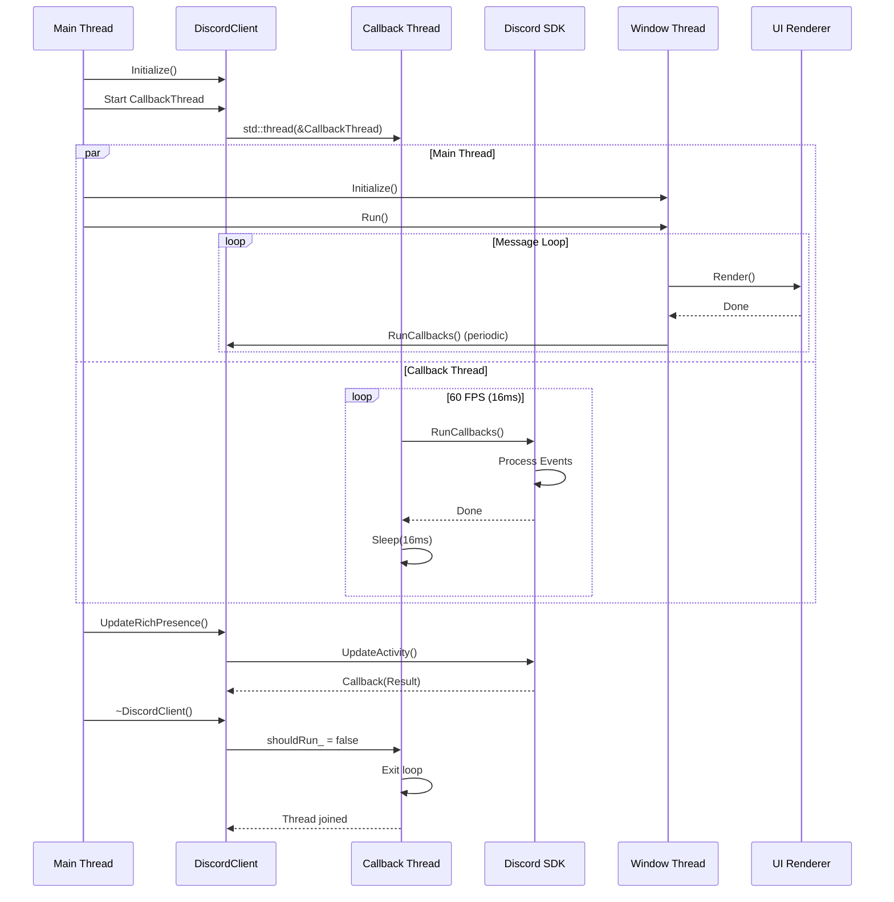

---

## 📦 9. Diagrama de Dependências

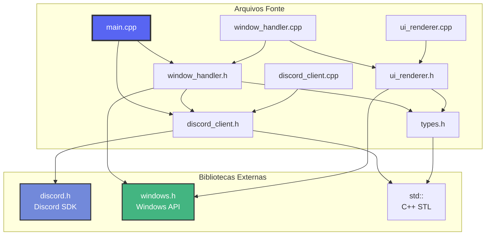

---

## 🎯 10. Diagrama de Casos de Uso

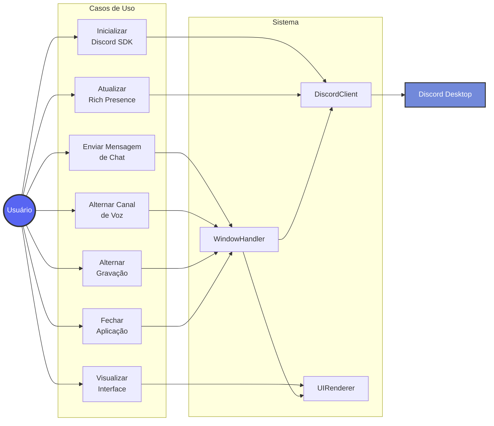

---

## 🔌 11. Diagrama de Integração com Discord SDK

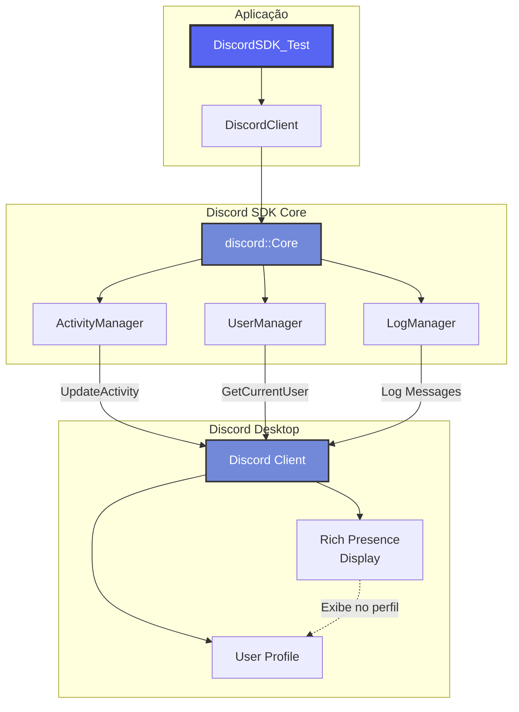

---

## 📊 12. Diagrama de Ciclo de Vida da Aplicação

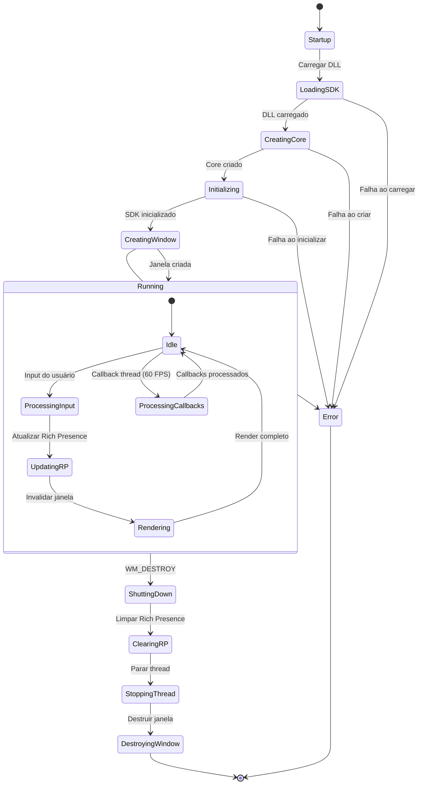

---

## 📝 Notas sobre os Diagramas

### Diagrama de Arquitetura
- Mostra a separação em camadas (Apresentação, Negócio, Dados)
- Demonstra a integração com Discord SDK
- Indica dependências do sistema operacional

### Diagrama de Classes
- Representa todas as classes principais
- Mostra relacionamentos (composição, agregação, uso)
- Inclui métodos públicos e privados

### Diagrama de Sequência
- Detalha o fluxo de inicialização
- Mostra interações entre componentes
- Inclui loops e threads

### Diagrama de Componentes
- Organiza o sistema em componentes reutilizáveis
- Mostra dependências entre componentes
- Separa implementação de interface

### Diagrama de Fluxo de Dados
- Mostra todo o fluxo de execução
- Inclui decisões e loops
- Indica tratamento de erros

### Diagrama de Estados
- Representa estados da aplicação
- Mostra transições entre estados
- Inclui estados aninhados

### Diagrama de Threads
- Demonstra concorrência
- Mostra sincronização
- Indica comunicação entre threads

---

**Última atualização:** Dezembro 2024  
**Versão dos Diagramas:** 1.0
