# 📊 Diagramas Adicionais - Discord SDK Test

Diagramas complementares para análise avançada do sistema.

---

## 🚀 1. Diagrama de Deployment

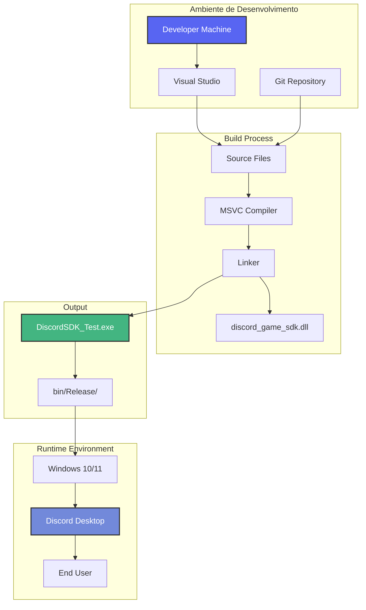

---

## 🌐 2. Diagrama de Rede e Comunicação

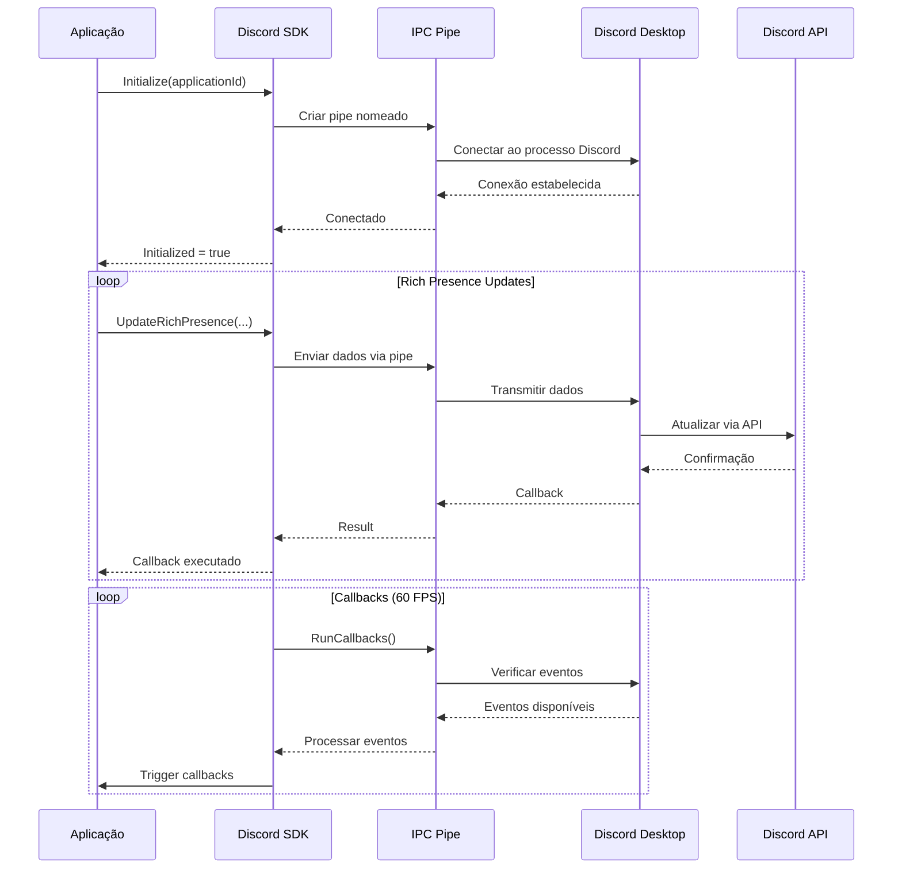

---

## ⏱️ 3. Diagrama de Timing

```mermaid
gantt
    title Ciclo de Vida da Aplicação
    dateFormat X
    axisFormat %L ms
    
    section Inicialização
    Carregar DLL           :0, 50
    Criar Core             :50, 100
    Obter Usuário          :100, 150
    Iniciar Thread         :150, 200
    Criar Janela           :200, 250
    Mostrar Janela         :250, 300
    
    section Execução
    Primeiro Render        :300, 350
    Message Loop           :350, 10000
    Callback Thread        :200, 10000
    
    section Atualização RP
    Usuário pressiona 'C'  :1000, 1050
    UpdateRichPresence     :1050, 1100
    Enviar para Discord    :1100, 1200
    Receber Callback       :1200, 1250
    Invalidar Janela       :1250, 1300
    Renderizar             :1300, 1350
    
    section Shutdown
    WM_DESTROY             :10000, 10050
    ClearRichPresence      :10050, 10100
    Parar Thread           :10100, 10150
    Destruir Janela        :10150, 10200
```

---

## 🔐 4. Diagrama de Segurança e Permissões

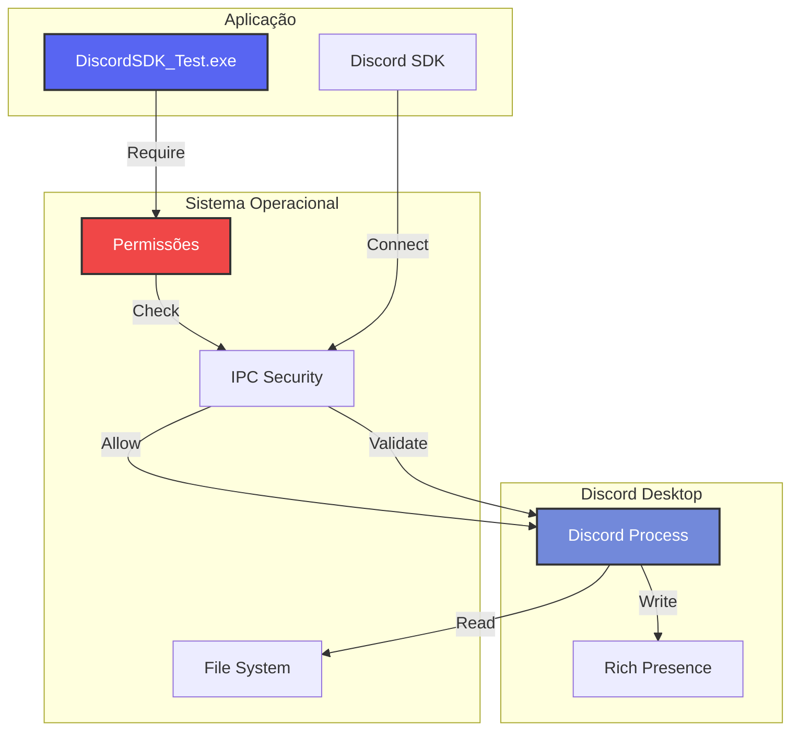

---

## 📈 5. Diagrama de Performance

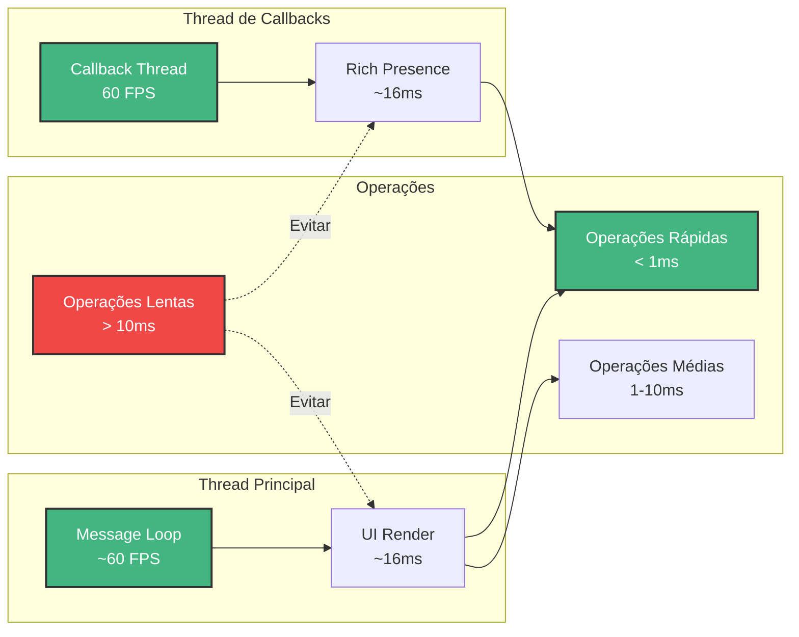

---

## 🔄 6. Diagrama de Atualização de Estado

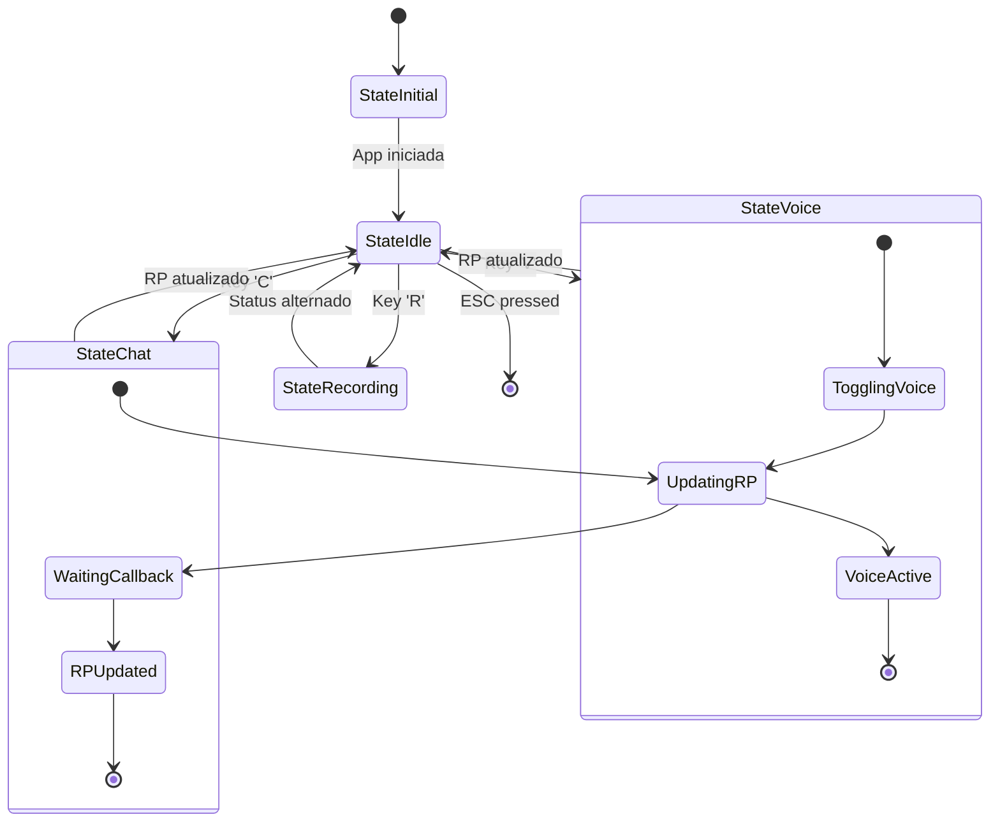

---

## 🧩 7. Diagrama de Módulos e Responsabilidades

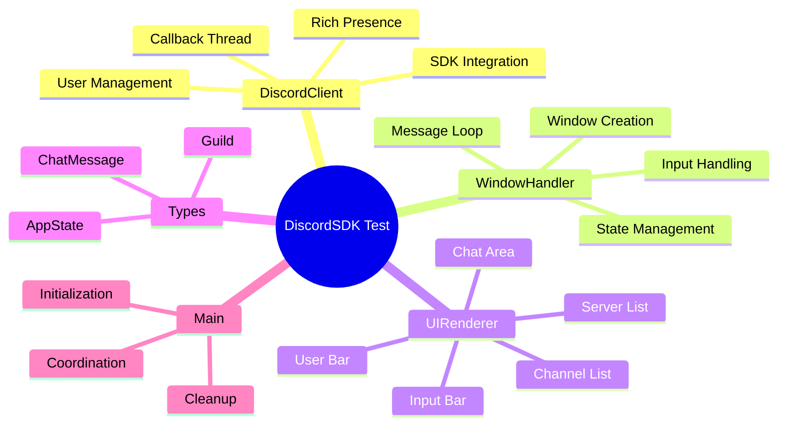

---

## 📊 8. Diagrama de Dados - Rich Presence

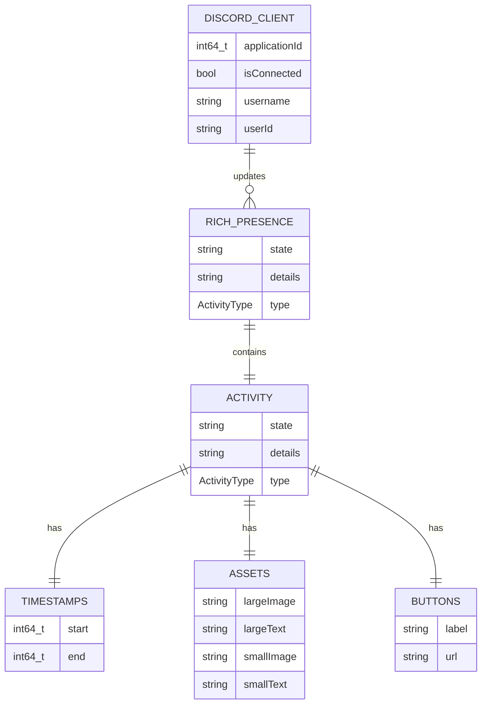

---

## 🔧 9. Diagrama de Build e Compilação

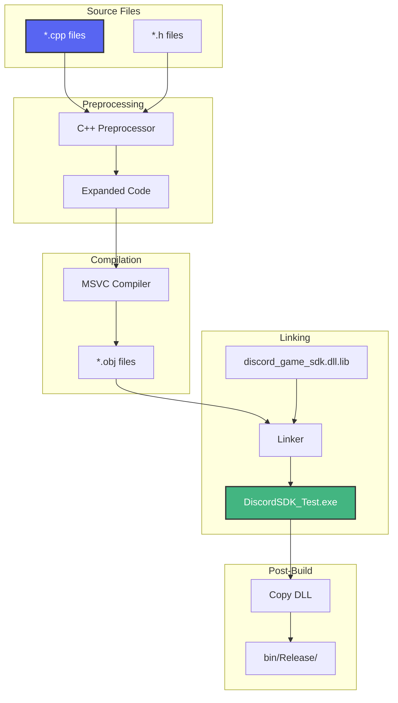

---

## 🎮 10. Diagrama de Interação do Usuário

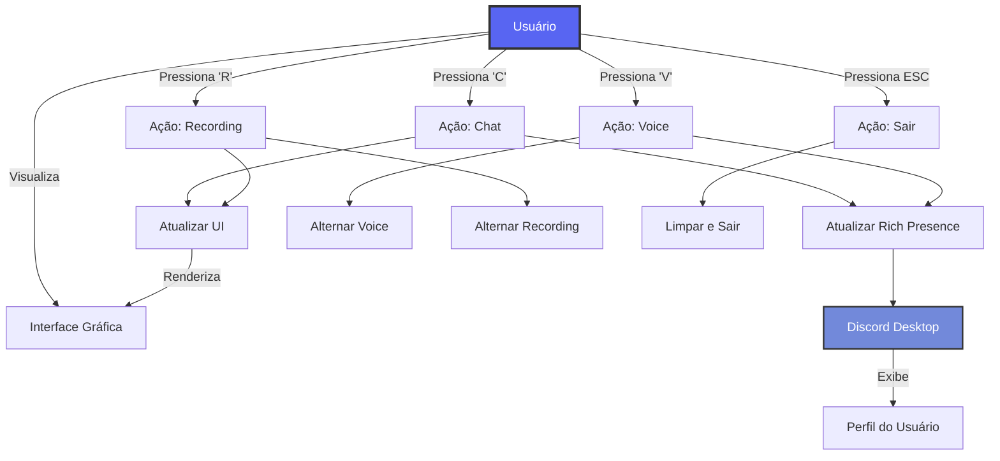

---

## 🔍 11. Diagrama de Debug e Logging

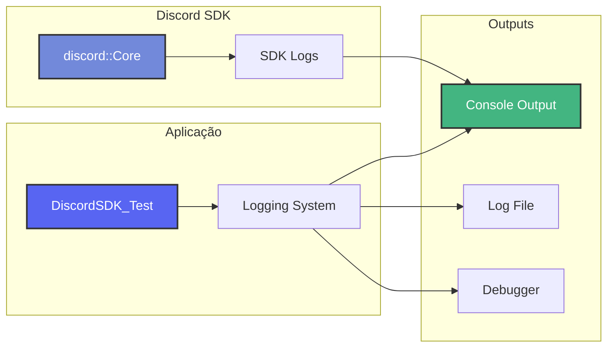

---

## 📦 12. Diagrama de Estrutura de Diretórios

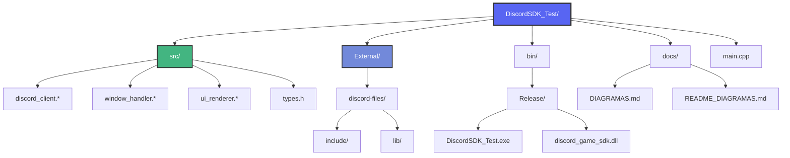

---

## 🎯 13. Diagrama de Decisão - Inicialização

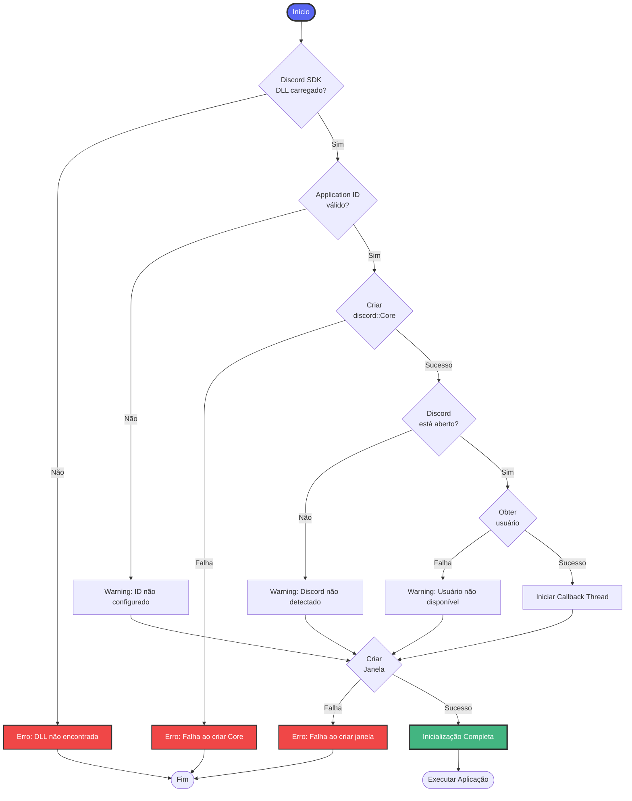

---

**Diagramas Adicionais - Para análise avançada**
